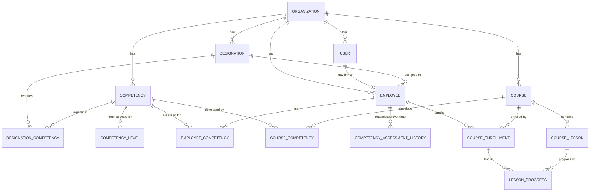

# Capacity Connect — Architecture & Design Document

*Digital Capacity Building and Learning Management Portal*
*Status: Proposal — awaiting approval before Phase 1 begins*

This document analyzes the specification and proposes a complete architecture. No implementation code is included. This is a standalone project — it does not use, extend, or depend on ClassroomIO in any way.

---

## 1. Technology Stack

| Layer | Choice | Why |
|---|---|---|
| Frontend | React + TypeScript | Type safety catches designation/competency/level mismatches at compile time — important given how relational this domain is. |
| Framework | Next.js (App Router) | Single codebase for UI + API (route handlers/server actions), file-based routing maps cleanly onto the nav structure requested, good defaults for a solo/student-scale project. |
| Styling | Tailwind CSS | Fast, consistent, no separate CSS files to maintain. |
| UI Components | shadcn/ui | Accessible primitives (table, dialog, tabs, badge, select) — badges are especially useful for gap status pills (Meets / Needs Improvement / Not Assessed). |
| Backend | Next.js Route Handlers (`app/api/**`) | Avoids running two servers; still a clean REST-shaped API as required in Section 13. |
| Database | PostgreSQL | Relational integrity (FKs, unique constraints, cascades) matters a lot here — this is fundamentally a relational modeling problem. |
| ORM | Prisma | Strong TypeScript inference, straightforward migrations, easy to enforce unique composite constraints (e.g. one `EmployeeCompetency` row per employee+competency). |
| Auth | Auth.js (NextAuth) with Credentials provider + bcrypt | Session-based, well-integrated with Next.js middleware for route protection, avoids hand-rolling session handling. |
| Charts | Recharts | Only used for the 2–3 places charts genuinely help (dashboard gap counts) — not decorative. |
| Testing | Vitest (unit tests for the skill-gap engine + validation), Playwright or simple API integration tests for key endpoints | Matches "unit tests for business logic, API tests for important endpoints" requirement. |

**No deviation from the recommended stack is proposed** — it fits the scale and goals well. The one addition is Auth.js, since the spec asked for "a secure modern authentication solution compatible with the selected stack" without naming one.

---

## 2. Core Architectural Principle

The skill-gap calculation, validation rules, and authorization checks all live in a **backend/business logic layer** (`lib/`), never duplicated in the frontend. The frontend only renders what the API returns. This directly satisfies Section 14's "do not duplicate this calculation throughout the frontend."

Multi-tenancy is enforced at the query layer: every Prisma query that touches organization-scoped data is required to filter by `organizationId` derived from the authenticated session — never from client-supplied input. This is elaborated in Section 8 below.

---

## 3. Database ER Design



### Notes on relationships
- `EMPLOYEE.designationId` is the pivot the whole skill-gap engine reads from.
- `DESIGNATION_COMPETENCY` and `EMPLOYEE_COMPETENCY` are both scoped indirectly by organization through their parent rows, but each also carries `organizationId` redundantly for query performance and defense-in-depth (see Section 8).
- `COMPETENCY_ASSESSMENT_HISTORY` is kept separate from `EMPLOYEE_COMPETENCY` (which holds the *current* level) so history doesn't complicate the "current state" read path that the skill-gap engine and dashboards hit constantly.

---

## 4. Main Tables

**Organization**
`id, name, description, logo, createdAt, updatedAt`

**User**
`id, name, email (unique per org), passwordHash, role (ADMIN | MANAGER | EMPLOYEE), organizationId, employeeId (nullable FK), createdAt, updatedAt`

**Employee**
`id, organizationId, employeeCode, name, email, department, designationId (nullable), joiningDate, status (ACTIVE | INACTIVE), createdAt, updatedAt`
- Unique: `(organizationId, employeeCode)`

**Designation**
`id, organizationId, title, code, description, createdAt, updatedAt`
- Unique: `(organizationId, code)`

**Competency**
`id, organizationId, name, description, category, createdAt, updatedAt`
- Unique: `(organizationId, name)`

**CompetencyLevel**
`id, competencyId, level (int), label (e.g. "Advanced"), description`
- Unique: `(competencyId, level)`
- Seeded default 1–5 scale (Beginner…Expert) per competency, editable per organization.

**DesignationCompetency**
`id, designationId, competencyId, organizationId, requiredLevel, createdAt, updatedAt`
- Unique: `(designationId, competencyId)` — prevents duplicate requirements.

**EmployeeCompetency**
`id, employeeId, competencyId, organizationId, currentLevel, assessedAt, assessedByUserId, createdAt, updatedAt`
- Unique: `(employeeId, competencyId)` — this row always holds the *latest* level.

**CompetencyAssessmentHistory**
`id, employeeId, competencyId, level, assessedAt, assessedByUserId`
- Append-only log; a new `EmployeeCompetency` write also inserts a history row.

**Course**
`id, organizationId, title, description, status (DRAFT | PUBLISHED), createdAt, updatedAt`

**CourseCompetency**
`id, courseId, competencyId, targetLevel`
- Unique: `(courseId, competencyId)`

**CourseLesson**
`id, courseId, title, content, order, createdAt, updatedAt`

**CourseEnrollment**
`id, employeeId, courseId, enrolledAt, status (IN_PROGRESS | COMPLETED), completedAt`
- Unique: `(employeeId, courseId)`

**LessonProgress**
`id, enrollmentId, lessonId, completed (bool), completedAt`
- Unique: `(enrollmentId, lessonId)`

All tables carry `createdAt`/`updatedAt`. All organization-scoped tables index `organizationId`; frequently filtered join columns (`employeeId`, `competencyId`, `designationId`, `courseId`) are indexed as well.

Skill gap itself is **not** a table — it's always computed on read from `DesignationCompetency` + `EmployeeCompetency`, per Section 4's instruction that it "should NOT normally be manually entered."

---

## 5. Skill-Gap Engine Design

Lives at `lib/skill-gap/calculateSkillGap.ts` as a pure function, unit-testable without touching the database:

```
Input:  requiredCompetencies: { competencyId, requiredLevel }[]
        currentCompetencies:  { competencyId, currentLevel }[]

Output: {
  competencyId, competencyName,
  requiredLevel,
  currentLevel | null,
  gap,
  status: "MEETS_REQUIREMENT" | "NEEDS_IMPROVEMENT" | "NOT_ASSESSED"
}[]
```

Logic (matches Section 14 exactly):
- No current record → `gap = requiredLevel`, `status = NOT_ASSESSED`
- `gap = max(0, required - current)`
- `gap === 0` → `MEETS_REQUIREMENT`, else `NEEDS_IMPROVEMENT`

A second function, `summarizeOrganizationSkillGaps()`, aggregates this per-employee result across all employees in an org to power the Organization Skill Gap Dashboard (counts per competency, employees-with-gaps totals). Both API routes (`/employees/:id/skill-gaps` and `/skill-gaps/summary`) call into these same two functions — no parallel implementation.

Training recommendations (`/employees/:id/recommendations`) build directly on this output: for every competency with `status = NEEDS_IMPROVEMENT` or `NOT_ASSESSED`, look up published courses via `CourseCompetency`, ranked simply by whether `course.targetLevel >= employee's requiredLevel` first, then alphabetically. No ML/AI ranking, per Section 12's explicit instruction to keep this simple initially.

---

## 6. API Architecture

REST-shaped Next.js route handlers under `app/api/`, mirroring Section 13 exactly:

```
POST   /api/auth/login
POST   /api/auth/logout

GET    /api/employees
POST   /api/employees
GET    /api/employees/:id
PUT    /api/employees/:id
DELETE /api/employees/:id
GET    /api/employees/:id/competencies
POST   /api/employees/:id/competencies
PUT    /api/employee-competencies/:id
GET    /api/employees/:id/skill-gaps
GET    /api/employees/:id/recommendations

GET    /api/competencies
POST   /api/competencies
GET    /api/competencies/:id
PUT    /api/competencies/:id
DELETE /api/competencies/:id
GET    /api/competencies/:id/levels
POST   /api/competencies/:id/levels
PUT    /api/competency-levels/:id
DELETE /api/competency-levels/:id

GET    /api/designations
POST   /api/designations
GET    /api/designations/:id
PUT    /api/designations/:id
DELETE /api/designations/:id
GET    /api/designations/:id/competencies
POST   /api/designations/:id/competencies
PUT    /api/designation-competencies/:id
DELETE /api/designation-competencies/:id

GET    /api/skill-gaps
GET    /api/skill-gaps/summary

GET    /api/courses
POST   /api/courses
GET    /api/courses/:id
PUT    /api/courses/:id
DELETE /api/courses/:id
POST   /api/courses/:id/enroll
```

Every handler: (1) resolves the session, (2) checks role permission for that action, (3) scopes every DB query to `session.organizationId`, (4) validates input with Zod schemas in `lib/validations/`, (5) returns typed JSON errors (`{ error: { code, message } }`) — never a raw stack trace.

---

## 7. Authentication & Authorization Design

**Roles:** `ADMIN`, `MANAGER`, `EMPLOYEE` (matches Section 5 Module 1).

| Action | Admin | Manager/HR | Employee |
|---|---|---|---|
| Manage org settings, competencies, designations, competency-level scales | ✅ | ❌ | ❌ |
| Create/edit employees, assign designation | ✅ | ✅ | ❌ |
| Assess employee competencies | ✅ | ✅ | ❌ |
| View any employee's skill gap / profile | ✅ | ✅ | own only |
| Manage courses (create/publish) | ✅ | ✅ (optional: Admin-only, see open question) | ❌ |
| Enroll self in course, view own learning | ✅ | ✅ | ✅ |
| View org-wide dashboard | ✅ | ✅ | ❌ |

Implementation:
- Auth.js Credentials provider; passwords hashed with bcrypt.
- Session (JWT strategy) carries `userId, organizationId, role, employeeId`.
- Next.js `middleware.ts` blocks unauthenticated access to any non-public route and redirects to `/login`.
- A `requireRole()` helper wraps route handlers for role checks; a `scopeToOrg()` helper injects `organizationId` into every Prisma `where` clause so a client can never read/write another tenant's data by forging an ID (Section 20's "never trust organization IDs supplied by the client").

---

## 8. Frontend Route Structure

```
/login
/dashboard                          (role-aware: admin/manager view vs employee view)

/employees
/employees/[id]
/employees/[id]/assess

/competencies
/competencies/new
/competencies/[id]
/competencies/[id]/levels

/designations
/designations/new
/designations/[id]
/designations/[id]/matrix           (Module 6 — competency matrix editor)

/skill-gaps                         (org-wide table, Module 8/10)
/skill-gaps/[employeeId]            (single-employee detail, Module 9)

/courses
/courses/new
/courses/[id]
/my-learning                        (employee: enrolled courses + progress)
/recommendations                    (employee: gap-driven course suggestions)

/reports
/settings
```

Employee-role users are redirected away from `/employees`, `/competencies`, `/designations` list/edit routes at the middleware level, not just hidden in the nav.

---

## 9. Component Structure

```
components/
├── ui/                    shadcn primitives (button, table, dialog, badge, tabs, select)
├── layout/                AppShell, Sidebar, TopNav (role-aware nav)
├── employees/             EmployeeTable, EmployeeForm, EmployeeProfileCard
├── competencies/          CompetencyTable, CompetencyForm, LevelEditor
├── designations/          DesignationTable, DesignationForm, CompetencyMatrixEditor
├── skill-gaps/            SkillGapTable, GapStatusBadge, GapSummaryChart, TopGapsList
└── courses/                CourseCard, CourseForm, LessonList, EnrollButton, ProgressBar
```

`GapStatusBadge` is the one shared visual element used everywhere a gap status appears (employee profile, org dashboard, skill-gap table) — implemented once, styled by `status` prop, so "Meets / Needs Improvement / Not Assessed" always look identical across the app.

---

## 10. Validation Rules (Section 19, mapped to layer)

Enforced with Zod at the API boundary, and with DB constraints as a second line of defense:

- Non-empty `name`/`title` fields — Zod `.min(1)`
- `requiredLevel` / `currentLevel` must exist in that competency's `CompetencyLevel` set — checked against DB before insert
- Employee/Designation/Competency must belong to the requesting org — enforced by `scopeToOrg()` on every lookup, not just at create time
- No duplicate `(designationId, competencyId)` or `(employeeId, competencyId)` — DB unique constraint + friendly 409 error if violated

---

## 11. Seed Data Plan

- Organization: **KL University**
- Competency levels: default 1–5 scale (Beginner→Expert), applied to every seeded competency
- Competencies: Python, Machine Learning, NLP, Deep Learning, Communication
- Designations: AI Engineer, ML Engineer, Data Scientist, each with a required-competency matrix
- Employees: ~5–6, with varied `EmployeeCompetency` rows so some meet requirements and some show gaps (must include the Ravi Kumar example from Section 3 verbatim, since it's the worked example)
- Courses: 2–3 per weak competency (e.g. "Advanced Machine Learning", "ML Fundamentals"), each linked via `CourseCompetency`
- Demo users: one `ADMIN`, one `MANAGER`, one `EMPLOYEE` login, credentials documented in the README

---

## 12. Development Phases (adopting Section 23 order)

| Phase | Deliverable |
|---|---|
| 1 | Project scaffold, Prisma schema for Organization/User/Employee, Auth.js login/session, protected layout shell |
| 2 | Competency + CompetencyLevel CRUD (UI + API) |
| 3 | Designation CRUD + Designation Competency Matrix editor |
| 4 | Employee Competency Assessment (UI + API + history log) |
| 5 | Skill-gap engine (`lib/skill-gap`) + unit tests |
| 6 | Skill-gap UI: employee detail view, org-wide table, org dashboard summary |
| 7 | Course/Lesson CRUD + enrollment + progress tracking |
| 8 | Training recommendations (gap → course matching) |
| 9 | Dashboard polish, reports |
| 10 | Test coverage pass, validation hardening, security review, README |

Each phase will be delivered with: what was built, files touched, how to run it, how to test it, and what's left — as requested.

---

## 13. Open Questions / Assumptions Made

1. **Manager course-management rights** — spec says "Admin/Trainer" can manage courses but doesn't formally define a Trainer role alongside Admin/Manager/Employee. Assumption: Manager can create/edit courses; only Admin can delete or reassign organization settings. Flag if you'd rather introduce a separate `TRAINER` role.
2. **User vs Employee relationship** — spec lists `User` and `Employee` as separate entities with overlapping fields. Assumption: `User` is the login/auth identity; `Employee` is the HR/competency record; an `Employee`-role `User` links to exactly one `Employee` row via a nullable FK, so Admin/Manager users don't need an Employee record.
3. **Course recommendation ranking** — kept intentionally simple (target level match, then alphabetical) per the explicit "do not build a complicated AI recommendation system" instruction.

---

**Awaiting your approval before Phase 1 implementation begins.**
